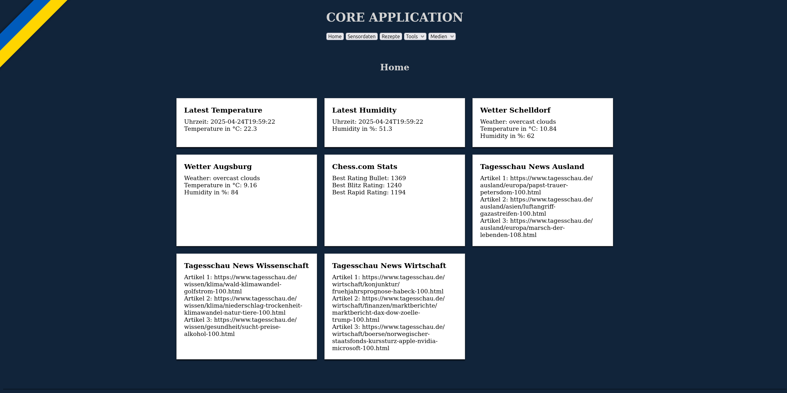
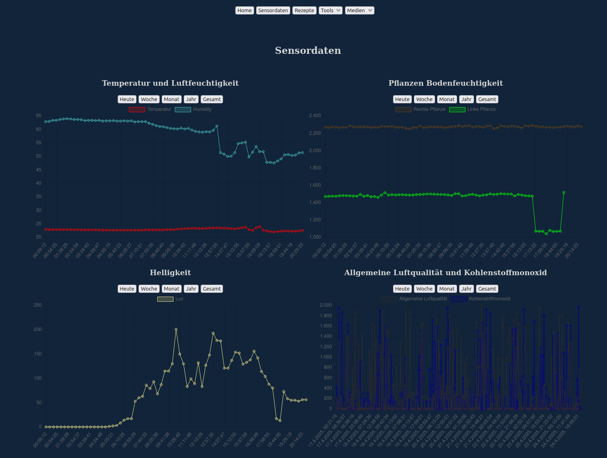
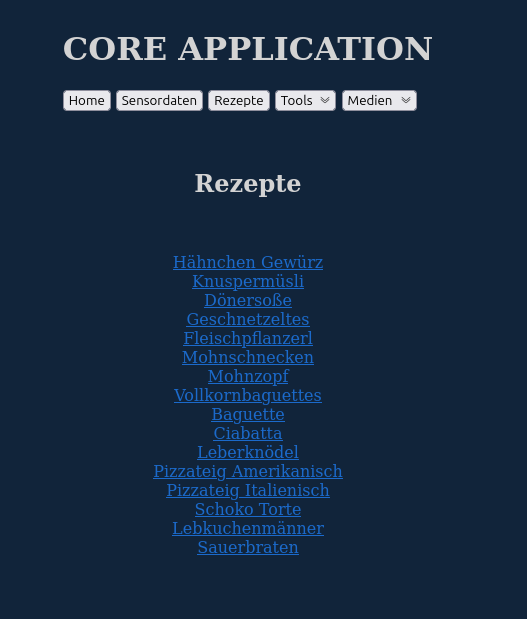
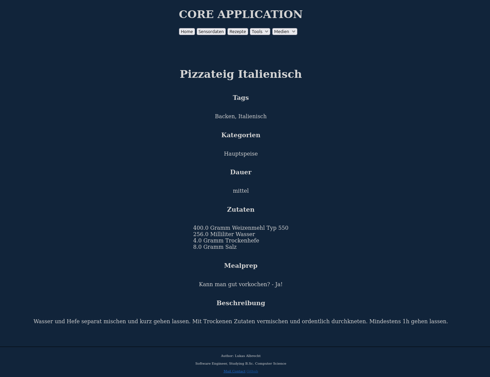
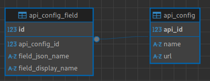
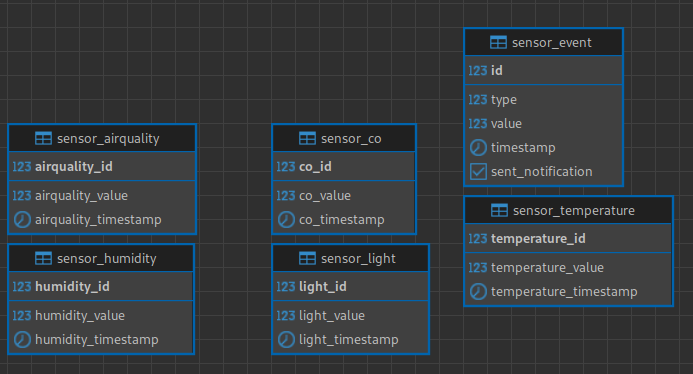
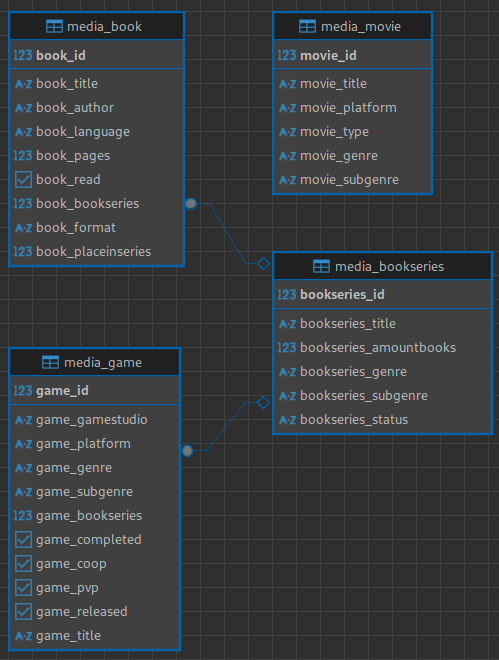
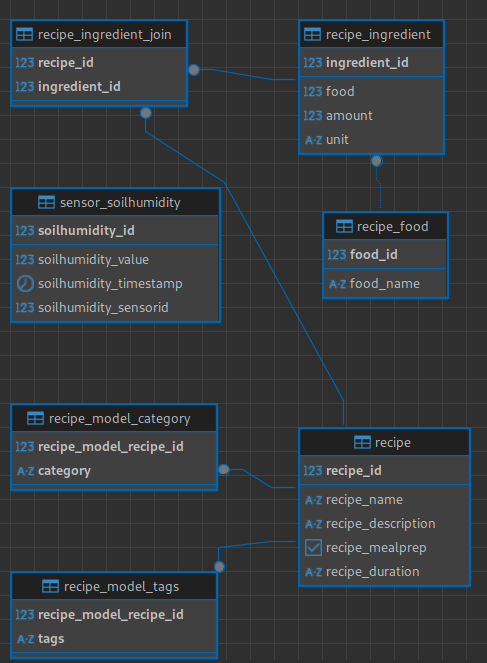

# Centralized Web Application
Dieses Projekt ist eine persönliche Website mit einigen Tools und Features.

## Motivation
Das Ziel dieses Projekts war es, außerhalb des beruflichen Umfelds grundlegende Kenntnisse in Spring
zu erwerben und die allgemeine Funktionsweise zu verstehen, die im Berufsalltag kaum berührt wird.

Neben dem Erwerb von Kenntnissen war auch das Handhaben eines größeren Projekts, 
einschließlich einer komplexeren Datenbank, ein wichtiger Motivationsfaktor.

Zusätzlich dazu war die tatsächliche Problemlösung, wie z.B. die Überwachung von Temperatur und 
Luftfeuchtigkeit oder die Verwaltung von Rezepten anstelle einer großen Textdatei, ein weiterer Anreiz.

## Features
### Dashboard
Customizable Dashboard mit einzelnen Modulen in denen APIs eingebunden werden können.
Derzeit sind folgende APIs in der Datenbank eingetragen:
* Temperatur und Luftfeuchtigkeit API Endpoint der eigenen Webanwendung
* OpenWeatherAPI2.5 mit dem Wetter in Augsburg und meinem Heimatsort
* Peak Ranking von Chess.com API
* Tagesschau API

Weitere APIs können modular eingebunden werden aktuell noch durch einen manuellen Eintrag in der Datenbank. 
Dort müssen die API-URL und die auszulesenden fields spezifiziert werden. Geparsed werden die Ergebnisse mit Jackson Databind

### Sensordaten
Eine Übersicht der angeschlossenen Sensordaten, inklusive Filtermöglichkeiten.

### Rezepte 
Eine Übersicht aller Rezepte, die jeweils zu der Detailspage weiterleitet.

Hier eine Beispiels-Detailpage

### Tools
Zudem gibt es noch einige kleine Tools, wie zum Beispiel einen Char-Counter, einen javascript-based finnish conjugator, einen password generator und mehr.

### Medien
Eine Medienübersicht in der alle Medien nacheinander nach Medienart gruppiert aufgelistet werden. Zudem gibt es jeweils eine Übersicht pro Medienart und auch jeweils eine Detailansicht.

In der Detailansicht werden alle Attribute aufgelistet und gegebenenfalls auf eine Buchserie verwiesen.

Die Thymeleaf Templates sind bei allen Mediatypes ungefähr gleich aufgebaut.

## Postgres Datenbank
Der derzeitige Stand der Postgres-Datenbank kann in der Datei  im Detail betrachtet werden.

### Dashboard

## Sensoren

## Media

## Rezepte

# Frontend

Das Frontend wurde mit html css und Thymeleaf templates umgesetzt. Wie zu erkennen ist, liegt der Fokus bei diesem Projekt _nicht_ auf dem Frontend.
Zur Visualisierung der Sensordaten wurde auf die Library [Chart.js](https://www.chartjs.org/) zurückgegriffen.

# Deployment
Deployed wurde auf einem Raspberry Pi 2B, der für diesen Zweck gerade noch ausreicht. 
Beim Laden _aller_ Daten in den Graph kann es mit wachsender Datenmenge zu performance Engpässen kommen. 
Allerdings ist dies für den Projektscope vollkommen akzeptabel.

Die Webanwendung wurde in einen Tomcat Server deployed, in Form einer war Datei. 
Zu Beginn wurde lediglich eine jar-Datei ausgeführt. Da in Zukunft aber womöglich noch andere Webanwendungen auf dem Pi laufen werden, wurde auf den Tomcat zum Verwalten aller Anwendungen gewechselt.
Auf dem selben RaspberryPi läuft ebenfalls ein selfhosted Github Acions Runner.
